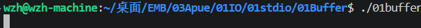
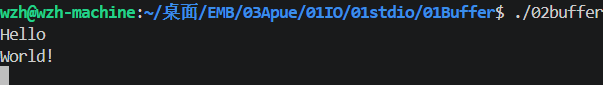
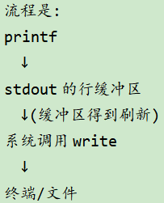

# 缓冲区
## `01buffer.c`
```C
#include <stdio.h>

int main(void){
    printf("Hello World!");
    while(1);  // 死循环
    return 0;
}
```
**输出结果**:

发现一直卡在这里。因为这里是死循环，stdout的缓冲区一直得不到刷新

## `02buffer.c`
```C
#include <stdio.h>

int main(void){
    printf("Hello\nWorld!\n");
    /* 
    通过printf(3)往stdout输出"Hello World!\n"，stdout是行缓冲的，
    所以stdout每遇到换行符'\n'时会才刷新缓冲区，将内容显示到终端
    */
    while(1);
    return 0;
}
```
**输出结果**:

printf()写入数据并不是立刻写到设备上的，而是先写入stdout的行缓冲区。当缓冲区得到刷新，才会经系统调用write写到设备上。
